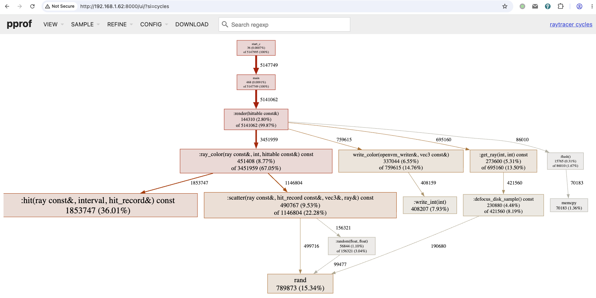

This doc contains the important design details for ray tracer on OpenVM.

# C++ guest program, Rust runner

The guest ray tracer program is completely [written in C++](../tracer_src), compiled via plaine `clang` / `ldd`. I re-use my old patched [musl libc](https://github.com/xxuejie/musl) and [libcxx](https://github.com/xxuejie/ckb-libcxx-builder) with OpenVM changes to provide libc / libc++ for the C++ program. Almost all platform-specific modifications are actually in musl libc, we can use libcxx almost unchanged (except one patch to remove CSR instructions from libunwind).

The runner driving OpenVM is [written in Rust](../runner) directly. For host-side prover code, Rust is perfectly fine.

# openvm-floating

I have a [separate repository](https://github.com/xxuejie/openvm-floating) implementing RISC-V `zfinx` / `F` extension. From execution point of view, it's not hard to do both so I implemented both for comparison. I should mention that I did design the RISC-V related guest part, but I utilize GLM 5.2 a lot to build the OpenVM transpiler and circuits. It runs code now, but there are some soundness bugs still.

# Output trick

Ray tracer builds images ranging from ~40KB to ~8MB, OpenVM reveals only a handful of u32 values. OpenVM guest program has 512MB of available memory.

To work around this, I configured heap to extend from `_end` symbol to 480 MB marker, and reserved the last 32MB for "pseudo outputs": ray tracer writes the final image to the last 32MB chunk of the memory, then runs sha256 hash on the full image. The hash is then revealed as public values. In the Rust runner code driving OpenVM, we can still read the full image from VM memory, and the revealed hash helps us verify the image. This approach allows us to handle larger outputs while fitting within OpenVM's proof constraints.

# Interpreter hook for profiling

I [patched OpenVM with an interprefer hook](https://github.com/xxuejie/openvm/commit/2c97976209bdb06c994990581a3b64ab53d1e3f1). This enables me to build a [profiler](https://github.com/xxuejie/ray-tracer-on-openvm/blob/main/profiler/src/lib.rs), we now have nice profiler chart for guest programs:



That being said there can also be other uses for the interpreter hook, e.g., debugger support.

# Performance numbers

```
| Jolt (rv64im + softfloat)                             | 166,905,547 cycles | 1x     |
| Jolt (rv64im + softfloat + non-float optimizations)   | 122,043,178 cycles | 1.36x  |
| OpenVM (rv32im + softfloat)                           | 123,294,825 cycles | 1.35x  |
| OpenVM (rv32im + softfloat + non-float optimizations) | 99,083,769 cycles  | 1.68x  |
| OpenVM (rv32imf)                                      | 29,591,216 cycles  | 5.64x  |
| OpenVM (rv32im_zfinx)                                 | 29,467,504 cycles  | 5.66x  |
| OpenVM (rv32imf + non-float optimizations)            | 5,283,763 cycles   | 31.58x |
| OpenVM (rv32im_zfinx + non-float optimizations)       | 5,147,995 cycles   | 32.42x |
```

Couple of notes:

* Cycles mean executed RISC-V instructions, assuming an IPC of 1. Of course cycles do not match prover costs directly, some instructions are more costly than others. Still it's intriguing that we can achieve much lower cycle consumption by introducing custom extensions.
* For softfloat workloads,  rv32im is faster than rv64im, my bet is that softfloat operations fit in 32-bit math, rv32 avoids sign/zero extensions required by rv64.
* F extension spends slightly more than zfinx extensions using the same setup, due to additional ABI work. For the ray tracer demo, register pressure of zfinx is not a problem.

Non-float optimizations refer to the following:

* https://github.com/xxuejie/ray-tracer-on-openvm/commit/e2cb0ee7398aad12052e25d699a5f2d2f36cacd4 C++ ostream costs a lot for RISC-V programs, we should get rid of it.
* https://github.com/xxuejie/ray-tracer-on-openvm/commit/7b71755c0335a0cd752a442f926df9c1310a5ac9 C/C++ code, and most especially Rust code tend to insert many memcpy / memset calls that can be avoided. We can remove them for even tighter programs. I actually ran into this a lot in my past experience dealing with RISC-V on-chain programs.

Custom extensions do yield the most speedups. OpenVM pioneers this, maybe we will also see it on other zkVMs in the future.
